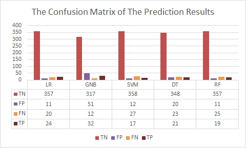
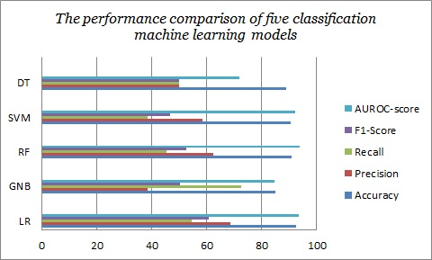

# Long-term-deposits-prediction
 Different machine learning models are used to predict the customer subscription of the long-term deposit namely Logistic Regression, Decision Tree, Random Forest, Gaussian Naive Bayes, and Support Vector Machine. These classification models are compared based on their performance such as accuracy, precision, recall, and F1 score.
 
 In this experiment, the main aim is to increase the model performance than the previous experiments and compare the machine learning model results and identify the best classification model for classifying the prospective customers who have the potential to be interested in long-term deposit products.
 
### Dataset:
 
 The proposed algorithm evaluated using Bank portugal dataset from UCI machine learning repository where this dataset belongs from bank retail in portugal by 2008-2010 years.
 The dataset consists of 4119 records, 20 attributes and 2 labels is deposit and non-deposit.
   
 Data is collected from website.
https://archive.ics.uci.edu/ml/datasets/bank+marketing

### Software Requirements          
             Operating System : Windows 7
             Development Kit : Python3.0, Jupyter Notebook, Anaconda

### Methodology:
 After importing the dataset, we have to analyze the dataset, to check the shape of the data, check the unique labels of the target variable (Y), check the data type of features and the descriptive statistics of the data.  
 
 After analyze the dataset we have to convert the categorical variable into numeric because the machine learning model work with only numeric features. I convert the categorical feature into numeric using the count_frequency encoding technique. 
 
 Before making the model we apply the standard scalar. Scaling technique  is useful as features should have the same order of magnitude for the algorithm to work properly.Then making model using different machine learning algorithms.

 After making the model, we have evaluate the performance of the model like accuracy, precision, recall, and F1 score based on the confusion matrix, ROC curve and AUROC score. 

#### Confusion matrix of the prediction results:

#### Performance comparison of machine learning models:
  

             
             

